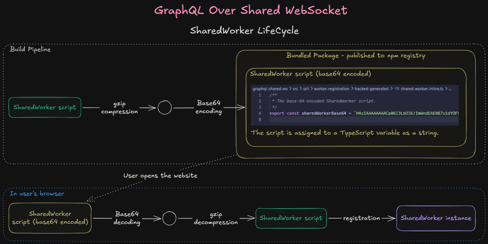
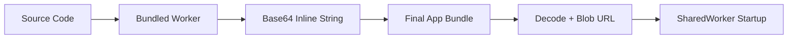

# SharedWorker Lifecycle

This flow shows how the worker script is produced, embedded, and then started in the browser.

## Build Pipeline

### 1. Worker Bundling: `pnpm build:worker-script`

The SharedWorker source code is bundled into a single, optimized script file. This stage performs tree-shaking and minification to ensure the worker logic is as compact as possible before it is converted into a string payload.

### 2. Script Inlining: `pnpm inline-worker-script`

The bundled script undergoes compression and is converted into a Base64-encoded string. This string is then written into a generated TypeScript module and assigned to a constant.

- **Key Advantage:** This makes the worker self-contained within the application bundle, removing the requirement for the browser to fetch a separate worker file over the network.

### 3) Final package bundling: `pnpm build-main`

The main package is bundled and published into npm registry. That bundle includes the generated TypeScript module containing the inline worker payload.

## Browser Runtime

Upon application load, the registration logic executes the following steps to start the worker:

1.  **Payload Access:** Reads the Base64-encoded string from the internal TypeScript module.
2.  **Decoding & Decompression:** Decodes the Base64 string and decompresses it back into the original JavaScript source.
3.  **Blob Creation:** Converts the raw script string into a `Blob` object and generates a unique `blob:` URL.
4.  **Initialization:** Instantiates the worker using `new SharedWorker(blobUrl)`.

At that point, the worker is registered and can start listening for messages and handling work in a shared context across browser tabs/windows for the same origin.

## Summary Flow

